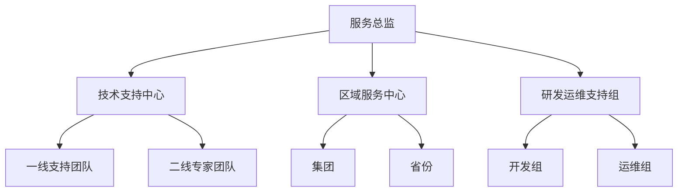

```mermaid
graph TD
    %% 定义节点样式为矩形
    %% 定义各个节点
    A[服务总监]
    B[技术支持中心]
    C[区域服务中心]
    D[研发运维支持组]
    E[一线支持团队]
    F[二线专家团队]
    G[集团]
    H[省份]
    I[开发组]
    J[运维组]

    %% 定义连接关系
    A --> B
    A --> C
    A --> D
    B --> E
    B --> F
    C --> G
    C --> H
    D --> I
    D --> J
```
